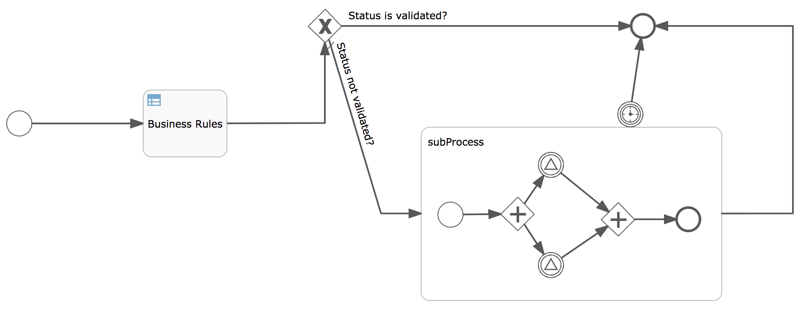

# flowable-poc
Flowable PoC Project

The repository contains multiple microservices. One of them is intended to request the client to be updated, another one is to validate and approve it. It order to track this process FLowable engine is used.

In order to run it you need to download Flowable tools first from here:

https://www.flowable.org/

And deploy them to tomcat. Those services use H2 DB by default so it needs to be configured properly. You need to install PosgtreSQL first, create DB flowable and user flowable/flowable. Then change the settings for necessary services (go inside of the jar files and modify connection properties). Then you can deploy them to tomcat and access the tools:

Flowable Admin - http://localhost:8080/flowable-admin
Flowable Modeller - http://localhost:8080/flowable-modeler
Flowable Task Manager - http://localhost:8080/flowable-task
Flowable Identity Manager - http://localhost:8080/flowable-idm

Then you can access Flowable Admin and deploy there the business process definition. You can find it in the repository as microservice.zip file. It contains set of definitions for process, forms etc.

Then you can start the microservices and test the functionality:

You can send POST request to http://localhost:8081/clients with necessary body client information. And the you can go to admin and check the process created.
